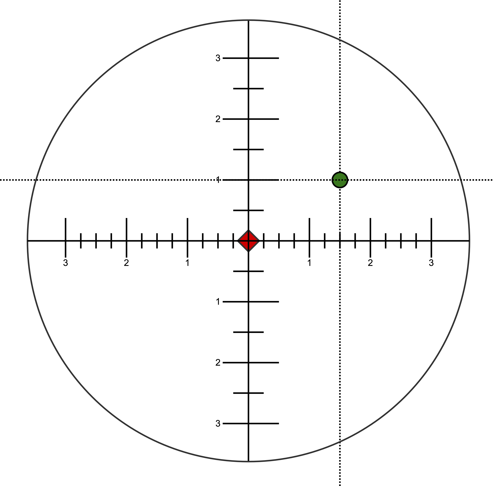

# Meta-Notes

* The "title" of each note has the format "( <date> ) <problem/thought/question>". The date component refers to the date the
  problem/thought/question popped up and does *not* imply the thought process/answer below the title was reached in one
  day. In fact, it is usually the case that the thought process/answer that is developed underneath the title was
  reached over multiple days.
* Additionally, *coherence* is not only not a requirement, it is rarely achieved. these notes can be incomplete
  sentences, random thoughts that trail off, etc. The notes are a means to and end, not the end itself.

## ( 2022-11-14 ): Underdstanding the limits of your system

Lets assume you have a scope that makes adjustments in 0.1 MILs. This means that the most granular adjustment you can
possibly make is:

* @ 100 meters: **1 centimeter** ( `100 / 1000 = 0.1 meters == 10 centimeters --> 10 * 0.1 = 1 centimeter` )
* @ 200 meters: **2 centimeters** ( `200 / 1000 = 0.2 meters == 20 centimeters --> 20 * 0.1 = 2 centimeters` )
* @ 300 meters: **3 centimeters** ( `300 / 1000 = 0.3 meters == 30 centimeters --> 30 * 0.1 = 3 centimeters` )
* @ 400 meters: **4 centimeters** ( `400 / 1000 = 0.4 meters == 40 centimeters --> 40 * 0.1 = 4 centimeters` )
* @ 500 meters: **5 centimeters** ( `500 / 1000 = 0.5 meters == 50 centimeters --> 50 * 0.1 = 5 centimeters` )
* @ 600 meters: **6 centimeters** ( `600 / 1000 = 0.6 meters == 60 centimeters --> 60 * 0.1 = 6 centimeters` )
* @ 700 meters: **7 centimeters** ( `700 / 1000 = 0.7 meters == 70 centimeters --> 70 * 0.1 = 7 centimeters` )
* @ 800 meters: **8 centimeters** ( `800 / 1000 = 0.8 meters == 80 centimeters --> 80 * 0.1 = 8 centimeters` )
* @ 900 meters: **9 centimeters** ( `900 / 1000 = 0.9 meters == 90 centimeters --> 90 * 0.1 = 9 centimeters` )
* @ 1000  meters: **10 centimeters** ( `1000 / 1000 = 1 meter == 100 centimeters --> 100 * 0.1 = 10 centimeters` )

Further, the above assumes:
* 0 variance from shooter error.
* 0 variance from the environment.
* 0 ballistic variance.

**Takeaway:**
Precision is relative to many systems interacting together.

## ( 2022-11-13 ): Making Adjustments to Different Distances

For the purposes of understanding, you could think about stratifying "adjusting to different distances" into 2
categories:
1. Situations where you want **the first shot to be as accurate as possible.**
2. Situations where the first shot doesn't have to be perfect.

Situation 1:
* Ballistic data is how you adjust to different distances.
* Check [this out](https://www.hornady.com/team-hornady/ballistic-calculators/?autopopulated_title=6.5+Creedmoor+140+gr+ELD%C2%AE+Match&weight=140&humidity=50&altitude=0&temperature=59&sightheight=1.5&shootingangle=0&pressure=29.92&maxrange=500&latitude=0&axialforceformfactore=1&azimuth=0&barreltwist=7&borediameter=&coriolis=0&windangle=90&windspeed=10&zerorange=100&zerorangeflag=1&velocity=2710&ballisticCoefficient=.646&ballisticCoefficientType=%28G1%29#!/standard)

Situation 2:
* Basically just take the shot, and then use your reticle to measure error (as mentioned below)

## ( 2022-11-13 ): Fixed Distance Sope Adjustments

Note that zeroing is a subset of **Fixed Distance Scope Adjustments**, and therefore all logic here should be applied to
zeroing your system.

(The following assumes a FFP scope in MILs)

* When you are making adjustments *at a fixed distance*, **you do not need to convert MILs to inches, centimeters, or
  any other non-angular measurement to zero your system.**

For example:
1. If you aim at the red diamond, and the shot ends up at the green circle, then you need to adjust your reticle such
   that the center is 1 MIL up and 1.5 MILs right of where it was when you pressed the trigger. Assuming your scope makes
   adjustments in 0.1 MILs, then this would be:

   ```
   <desired_total_adjustment_in_MILs> / <unit_of_click_in_MILs> = <total_clicks_to_adjust>
   1 MIL / 0.1 = 10 clicks up
   1.5 MILs / 0.1 = 15 clicks right
   ```
   * This is true if you are zeroing at 100, 200, 15, 1450 yards/meters/centimeters/miles; **the distance from the
     target not matter.**
   * **At no point do you need to convert measurements that aren't in MILs.**


